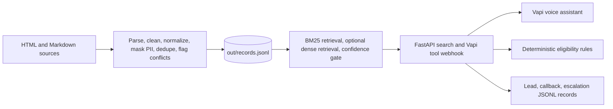

# Kestrel Capital: Q1 voice agent and Q2 knowledge base

This repository implements a fictional business-loan qualification assistant and the knowledge base it queries. All lender details and source data under `data/raw/` are mock data.

## Architecture



## Q2 knowledge base

Build the records and pipeline report, then generate the retrieval evaluation:

```powershell
python -m kb.pipeline
python -m kb.retrieval_eval
```

The pipeline reads HTML and Markdown from `data/raw/`, removes page boilerplate, normalizes terminology and dates, masks detected PII before persistence, removes near-duplicates, flags lower-priority conflicting records, chunks content by section, and writes traceable records to `out/records.jsonl`. Review `out/pipeline_report.json` for extraction errors, empty sections, deduplication, conflict resolution, and PII counts.

`kb.index` uses BM25 by default. The current default stays lexical because it runs without downloading an embedding model, handles exact policy numbers well, and passed the included 13-query set. Narrow caller-phrase normalization covers common terms such as “paperwork” and “months old”; out-of-scope loan types remain behind the confidence gate. This is a practical baseline, not evidence that lexical retrieval is best for all paraphrases. If `fastembed` is installed and `EMBED_MODEL` is configured, the index combines dense and lexical rankings with reciprocal rank fusion; rerun the same evaluation and compare excerpts and verdicts before changing the default. The report contains retrieved text, source, section, version, relevance rationale, confidence, and a keyword-based verdict.

Record schema: `record_id, title, content, category, section_path, source, source_type, source_url, version, effective_date, updated_at, language, pii, pii_types, priority, status, content_hash`.

## Q1 voice agent

The assistant prompt contains conversation flow and safety rules. Product and policy facts are retrieved through `search_knowledge_base`; eligibility is calculated by `api/eligibility.py` using `config/rules.json`. The FastAPI app exposes `/health`, `/search`, and `/vapi/tools`. The webhook can also log leads, callbacks, and human escalations in `out/`.

### Local setup

```powershell
python -m venv .venv
.venv\Scripts\Activate.ps1
pip install -r requirements.txt
Copy-Item .env.example .env
python -m kb.pipeline
python -m kb.retrieval_eval
uvicorn api.main:app --port 8000
```

Check `http://127.0.0.1:8000/health` and use `POST /search` to exercise retrieval locally.

Run the local, non-voice scenario checks after building the KB:

```powershell
python -m qa.local_scenario_check
```

This checks eligibility outcomes, grounded objection retrieval, incomplete details, out-of-scope refusal, prompt coverage for conflicting details, do-not-call handling, sensitive-data instructions, and that the human handoff is wired. It writes `out/local_scenario_report.md`. The handoff action is not invoked because it writes an escalation and may call an external webhook. These checks are not recorded calls and do not validate multi-turn behavior.

### Connect Vapi

Set `PUBLIC_BASE_URL` to the HTTPS URL that reaches this API, `VAPI_API_KEY` to a Vapi private key, and `VAPI_SERVER_SECRET` to a long random value. In Vapi, create a custom credential with header name `x-vapi-secret` and the same secret value; put its credential ID in `VAPI_CREDENTIAL_ID`. Configure the assistant and connect a Vapi web-call interface or phone number:

```powershell
python agent/create_assistant.py
```

The script prints the created assistant response. Do not commit `.env`, credentials, or customer records. The assistant is not deployed and real calls are not recorded by this repository until valid provider credentials, a public HTTPS endpoint, and a Vapi call interface are configured.

## Q3 localized voice-bot prototypes

Q3 assets are separate from the English Kestrel loan agent. `q3/profiles.json` contains localized flows, mock rules, terminology, ASR/TTS settings, test utterances, and localization examples; `q3/prompts/` contains the Filipino/Taglish bancassurance and Indonesian multifinance prompts. Product names and policy details are explicitly fictional.

Run static coverage and inspect Vapi payloads without creating assistants:

```powershell
python -m q3.check_profiles
python -m q3.create_assistants --dry-run
```

After configuring Vapi credentials and provider keys, create the two assistants with `python -m q3.create_assistants`. The profiles use separate Deepgram Nova-3 language settings (`tl` for Tagalog, `id` for Indonesian) and Azure Filipino/Indonesian voices. Deepgram lists Tagalog and Indonesian as Nova-3 languages, while its listed `multi` option does not include these languages; therefore code-switch performance is an explicit test risk, not a claimed capability. See [Deepgram language support](https://developers.deepgram.com/docs/models-languages-overview) and [Azure voice support](https://learn.microsoft.com/en-us/azure/ai-services/speech-service/language-support).

The static checker does not measure recognition quality, naturalness, regional accent performance, or compliance. Record two calls per market, include Taglish and mixed finance terms, and have native speakers review the East Java accent tests before reporting those results.

## Q4 live call insights and nudges

`q4.engine` detects risky promises, a missing disclosure, frustration, payment hardship, topic shifts, human requests, and a missed second-vehicle cross-sell. Nudges have confidence thresholds, priorities, topic groups, a 45-second cooldown, 30-second expiry, and a low-ASR-confidence filter. `q4.api` exposes session creation, transcript ingestion, active-nudge polling, and component metrics.

The Q4 API is a local prototype with in-memory sessions and no authentication. Keep it on localhost; add authentication, rate limits, retention controls, and shared state before exposing it publicly.

Run deterministic checks and the transcript replay API:

```powershell
python -m q4.check_scenarios
python -m uvicorn q4.api:app --port 8012
```

In another terminal, replay the synthetic transcript on its original timing (the default is real-time):

```powershell
python -m q4.replay_transcript
```

That replay verifies signal delivery and local HTTP latency, but it is transcript input, not audio/ASR evidence. For a real recording replayed as PCM chunks at real-time speed, install the optional dependency and supply a 16-bit WAV:

```powershell
pip install -r requirements-q4-audio.txt
python -m q4.audio_replay path\to\call.wav --language en-US --agent-speaker-id 1
```

Set `DEEPGRAM_API_KEY` in `.env`; adjust the language and diarized agent speaker ID for the recording. Audio replays write per-session results under `out/`, which is gitignored. ASR, signal, and API round-trip latency are measured separately; a deployed dashboard must measure its own poll-to-render latency. The rule-based engine has zero LLM latency.

The Q4 store is in-memory and single-process. At 10x load, move sessions to shared state, use a durable event stream and WebSocket/push delivery, bound transcript retention, and profile ASR/network queues. Regex signals are explainable but need labelled noisy-call data and human review to estimate false positives reliably.

## Existing evidence and current status

- The checked-in pipeline output records 27 total records, 25 active records, three lower-priority conflicts, one duplicate, one empty section, and masked PII. Regenerate these reports after changing source files.
- The retrieval report covers the required Q2 question types. Its verdict is a lightweight keyword check; inspect the returned chunk and relevance rationale manually before relying on it.
- Q3 static profile coverage passed for both markets; actual provider, native-speaker, code-switch, accent, and recorded-call evaluations remain outstanding.
- Q4 deterministic checks pass 10 scenarios. Synthetic transcript replay records API latency and generated nudges; no real audio, ASR latency, or dashboard display latency has been captured yet.
- The local Swagger UI (`/docs`) webhook and HTTP `/health`, `/search`, and `/vapi/tools` paths have been exercised. Eligibility, retrieval, and webhook paths are implemented.
- Real end-to-end voice behavior, at least three recorded calls, transcripts, and call results still require a configured Vapi account and should be added under `out/call_evidence/` after making calls. Do not present local endpoint checks as recorded calls.

## Design choices and limitations

- Eligibility decisions are deterministic and preliminary; they are never approval guarantees.
- Higher-priority policy sources win conflicts; losing website records remain traceable but are excluded from retrieval.
- PII masking runs before records are written. Person-name detection uses an optional Presidio analyzer or a narrow regex fallback, so it is not a general-purpose PII detector.
- The included source parsers handle HTML and Markdown only. Add and validate PDF/OCR or form parsers if those inputs are introduced.
- The Q1 assistant is English-only. Q3 language support is provided by separate prototype profiles. Eligibility rules duplicate some policy facts in the knowledge base and need coordinated updates.
