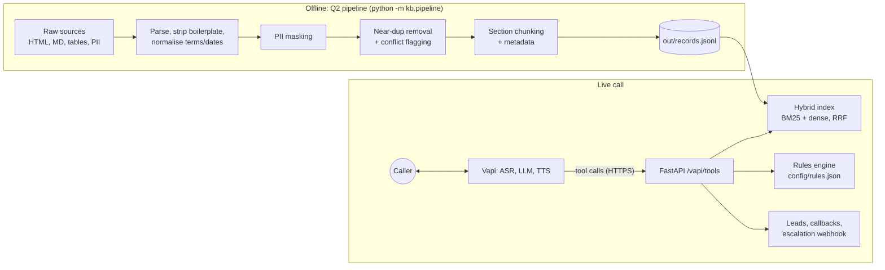

# Kestrel Capital: Knowledge-Grounded Voice Agent (Q1 + Q2)

Use case: **business-loan qualification**. Lender, data and numbers are fictional mock data in `data/raw/`; replace them with the provided script, rules and sources.

## Architecture



## Design decisions (and why)
| Decision | Reason |
|---|---|
| System prompt has flow + rules only; every fact comes from `search_knowledge_base` | Required by the brief; also means policy changes need a re-index, not a prompt edit |
| **Confidence gate** on retrieval: below threshold returns `NO_RELEVANT_INFORMATION` | Forces "I don't have that information" instead of hallucination |
| Eligibility is deterministic code (`api/eligibility.py`), not LLM judgement | Auditable, testable, can't be talked around. Rules mirror the policy in the KB, so update both (known duplication) |
| Conflicting sources: the higher-priority source wins, the loser is kept but `status=flagged_conflict` and not indexed | The website says ₹20 lakh turnover / 1 year vintage / 1% fee; the credit policy says ₹25 lakh / 2 years / 1 to 2%. The bot must not quote the wrong one. See `out/pipeline_report.json` |
| PII masked **before** storage; `pii` and `pii_types` recorded per record | Originals never enter the index or the LLM context |
| Hybrid lexical + dense retrieval, with lexical-only fallback | Dense handles paraphrase; BM25 handles exact numbers and terms; the system still works if embeddings fail to load |
| Tool failures return a spoken-safe fallback string | A webhook outage must not produce a silent or invented answer |

## KB record schema
`record_id, title, content, category, section_path, source, source_type, source_url, version, effective_date, updated_at, language, pii, pii_types, priority, status, content_hash`

Taxonomy (`category`): `product, eligibility_policy, pricing_fees, documents, process, compliance, faq, objection_handling, contact, about`.
Citation format returned with each result: `record_id | source | section_path | vX`.
Versioning: each record carries the source document version + `content_hash`; re-running the pipeline regenerates the file, so diff `records.jsonl` in git to see changes.

## Setup (when you are ready to run)
```bash
pip install -r requirements.txt
cp .env.example .env            # fill in keys; never commit .env
python -m kb.pipeline           # builds out/records.jsonl + out/pipeline_report.json
python -m kb.retrieval_eval     # Q2 retrieval table -> out/retrieval_report.md
uvicorn api.main:app --port 8000
ngrok http 8000                 # put the https URL in PUBLIC_BASE_URL
python agent/create_assistant.py
```
Then use Vapi's dashboard: attach a phone number or use the assistant's web "Talk" button for the callable interface.

## Status
**Written but not yet executed or tested.** Expect to fix small issues on first run. Items to verify first:
1. `python -m kb.pipeline` output: check `pipeline_report.json` shows the duplicate "About" section dropped, three conflicts flagged, the PII masked, and the empty "Loan Calculator" section reported.
2. Retrieval thresholds (`MIN_CONFIDENCE`): tune using `retrieval_eval`, especially the out-of-scope query.
3. Vapi payload field names against current docs.

## Known limitations
- English only here; Q3 needs multilingual embeddings, native prompts, and per-market ASR/TTS.
- PII names use a regex heuristic unless Presidio is installed.
- No PDF or OCR parser yet (the mock data has none); add `pymupdf` and `pdfplumber` for real PDFs.
- Eligibility rules are duplicated between `rules.json` and the policy text.
